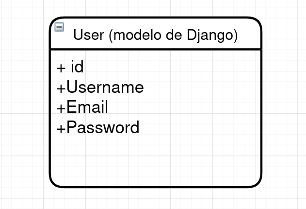
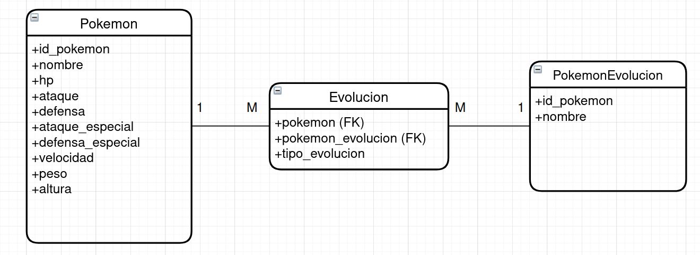
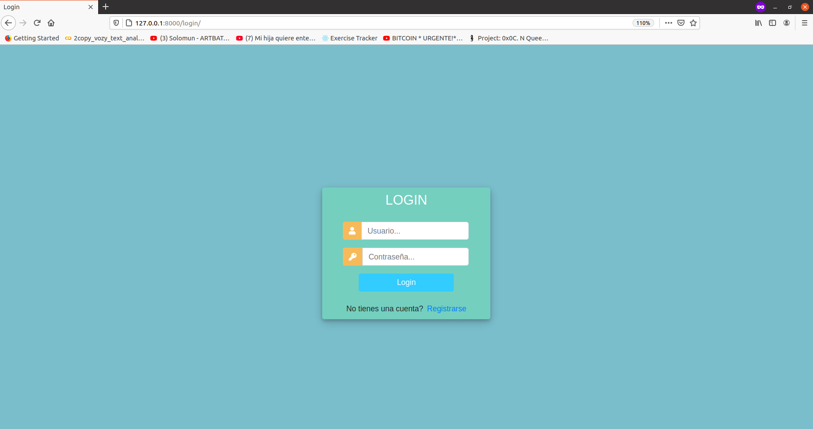
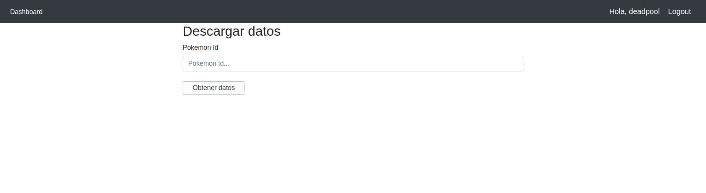
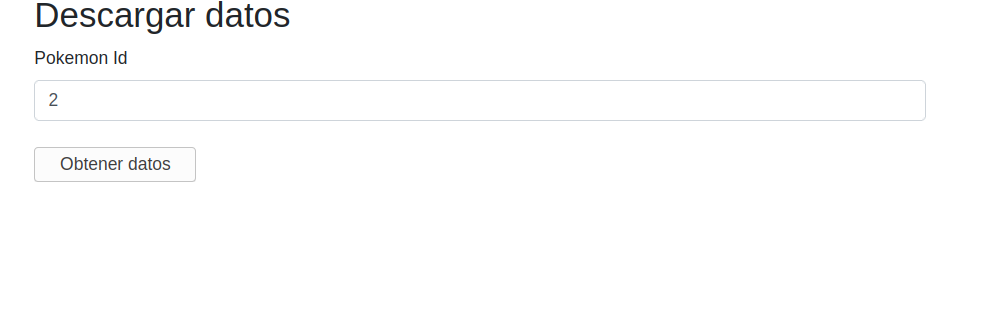
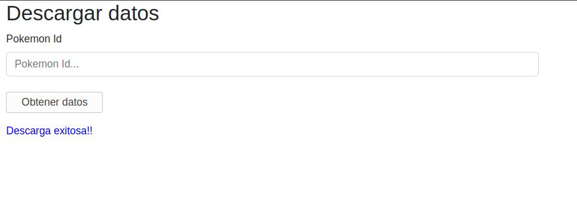
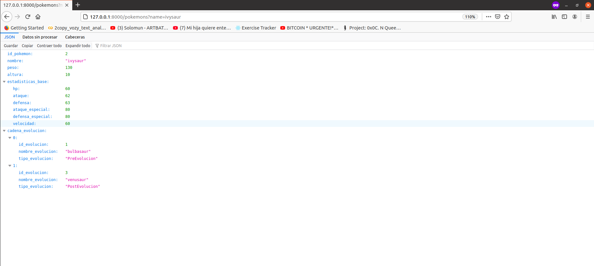
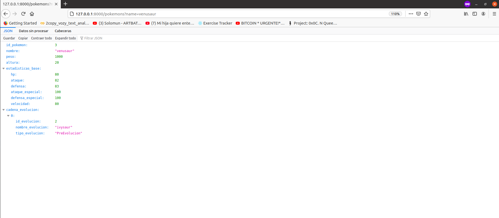

# Poke API

## Tabla de Contenido
* [Descripción](#descripcion)
* [Instalación](#instalacion)
* [Descripción de Archivos](#descripcion-de-archivos)
* [Modelos Diagrama](#modelos-diagrama)
* [Ejemplos de Uso](#ejemplos-de-uso)
* [Autores](#authors)

## Descripción
Aplicación para consumir la [PokeApi](https://pokeapi.co/docs/v2) por id del pokemon y guardar su información en una base de datos, incluyendo información relacionada a toda su cadena de evolución.

## Instalación

1. Clonar este repositorio `git clone https://github.com/ikki2530/pokeapi_app.git`
2. Crear un virtual environment y activarlo, para más información ingresa a este [link](https://www.geeksforgeeks.org/python-virtual-environment/)
3. Acceder al directorio poke_project `cd /pokeapi_app/poke_project`
4. Instalar dependencias del proyecto `pip install -r requirements.txt`
5. Generar las migracions `python manage.py makemigrations`
6. Ejecutar las migraciones `python manage.py migrate`
7. Crear un super usuario `python manage.py createsuperuser`
8. Correr el servidor de DJango `python manage.py runserver`

## Descripción de Archivos
[requirements.txt](/poke_project/requirements.txt) - Dependencias necesarias para el proyecto.

[.gitignore](.gitignore) - Lista de archivos ignorados por git

[manage.py](/poke_project/manage.py) - Script para correr tareas administrativas en Django.

### `poke_project/pokemons` Contiene el desarrollo de la aplicación (vistas, modelos, etc).
- [pokemons/urls.py](/poke_project/pokemons/urls.py) - Contiene las urls relacionadas con la app.
- [pokemons/views.py](/poke_project/pokemons/views.py) - Contiene las vistas de la app (Index, Login, registro, etc.)
- [pokemons/models.py](/poke_project/pokemons/models.py) - Contiene los modelos para crear la base de datos.
- [pokemons/admin.py](/poke_project/pokemons/admin.py) - Archivo usado para desplegar los modelos en el panel de administración.
- [pokemons/decorators.py](/poke_project/pokemons/decorators.py) - Decorador usados para verificar si el usuario está autenticado.
- [pokemons/evolutions.py](/poke_project/pokemons/evolutions.py) - Funciones para guardar y crear las relaciones entre los pokemons en la base de datos.
- [pokemons/forms.py](/poke_project/pokemons/forms.py) - Formularios necesarios para la app (registro).
- [pokemons/pokemons2.py](/poke_project/pokemons/pokemons2.py) - Funciones para extraer los datos de la PokeApi

#### `poke_project/pokemons/templates` - Contiene los templates utilizados en toda la app.
- [pokemons/templates/index.html](/poke_project/pokemons/templates/index.html) - Página principal de la app.
- [pokemons/templates/login.html](poke_project/pokemons/templates/login.html) - Template del login.
- [pokemons/templates/main.html](poke_project/pokemons/templates/main.html) - Esquema inicial para otros templates (index).
- [pokemons/templates/navbar.html](poke_project/pokemons/templates/navbar.html) - Barra de navegación.
- [pokemons/templates/register.html](pokemons/templates/register.html) - Template de registro.

#### `poke_project/pokemons/migrations` - Contiene las migraciones realizadas a la base de datos.

### `poke_project/poke_project` Contiene el desarrollo de la aplicación (vistas, modelos, etc).
- [poke_project/settings.py](/poke_project/poke_project/settings.py) - Contiene todas las configuraciones necesarias para el funcionamiento del proyecto.
- [poke_project/urls.py](/poke_project/poke_project/urls.py) - Archivo de urls principal.

## Modelos Diagrama

- Para los usuarios se utilizó el modelo predeterminado de Django (User).

- Para los pokemons se creó el siguiente modelo.

- `Pokemon`: es el modelo que almacena los pokemons con todas sus estadísticas.
- `PokemonEvolucion`: es la evolucion de `Pokemon` (ya sea preevolucion o postevolucion).
- `Evolucion`: determina el tipo de evolución entre `Pokemon` y `PokemonEvolucion`.

## Ejemplos de uso

- Incialmente la base de datos no tiene pokemons.
- Ingresa a tu localhost (en mi caso `http://127.0.0.1:8000`) registrate y luego te logueas.

- Después de loguearse aparece un formulario como el siguiente donde se ingresa el id del pokemon para extraer su información de la PokeApi y guardarla en la base de datos. (mi usuario es deadpool).

- Ingresa un número en el formulario, si el resultado es exitoso se debe mostrar este mensaje `Descarga Exitosa!!`
- Nota: id=2 corresponde a ivysaur (postevolución de bulbasaur)

- Endpoint para verificar la api `127.0.0.1:8000/pokemons?name=pokemon_name`
- Para acceder a la api debes estar logueado.

- Ahora se verifica la api con el parametro `name` y se le pasa el valor `ivysaur`

- También es posible verificar sus evoluciones `name=bulbasaur` o `name=venusaur`.

## Autores

* Diego Gomez- [Linkedin](https://www.linkedin.com/in/diego-g%C3%B3mez-8861b61a1/) / [Twitter](https://twitter.com/dagomez2530)
